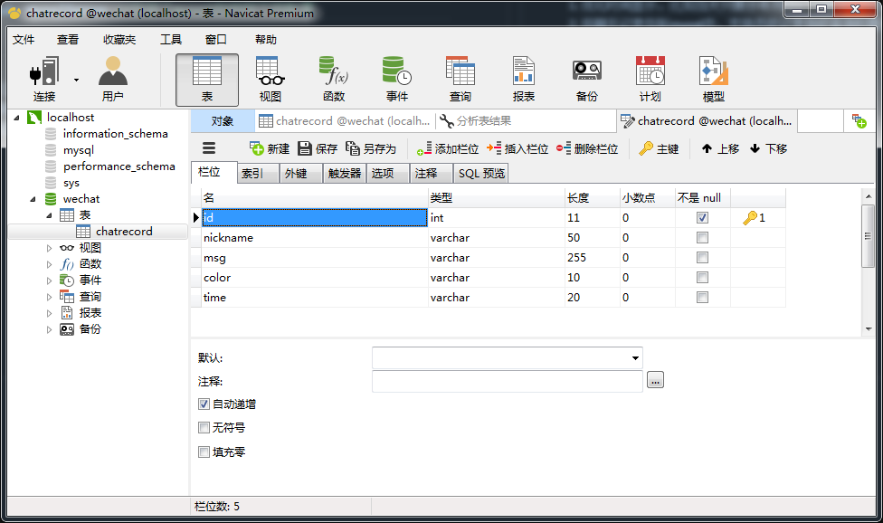

# 基于node的聊天室
* nodejs
* express
* socket.io
* mysql

```javascript
 1. npm install
 2. node service //启动不带数据库的服务器,聊天内容存在txt文本中
 3. node mysqlServe //安装了mysql的按照下图配置
```


1. 优化时间显示，比如当天只展示年月日；一分钟之内不显示时间
2. 将聊天记录存到mysql中，支持历史记录倒叙查询和展示了（之前的本地txt存储方式注释掉）